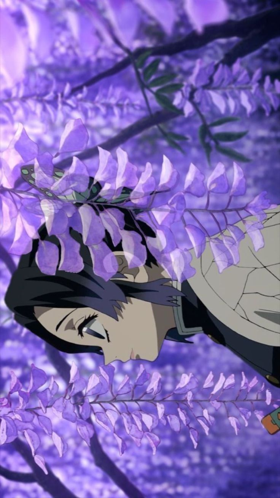

<!-- 🌸 GitHub Profile — Shinobu Kochou Theme -->

  

<h1 align="center">🦋 こんにちは, I'm <strong>Satriasensei</strong></h1>

  

  <em>“Even the smallest poison can bring down a giant.” — Shinobu Kochou</em>

---

## 🦋 About Me
- 💜 Shinobu Kochou admirer  
- 🧪 Focused on **Laravel, Tailwind CSS, JavaScript, MySQL**  
- 🌱 Learning **Clean Architecture & Software Testing**  
- 📫 Email: **igedesatriaadinata@gmail.com**  
- 📷 Instagram: [@satria_adinata15](https://instagram.com/satria_adinata15)

---

## 🌐 Connect

  
  
  

---

## ⚙ Tech Stack

  

---

## 🏆 GitHub Overview

  
  

  
  

  

---

## 📌 Featured Projects

  

---

## 🐍 Contribution Snake

  

---

  

