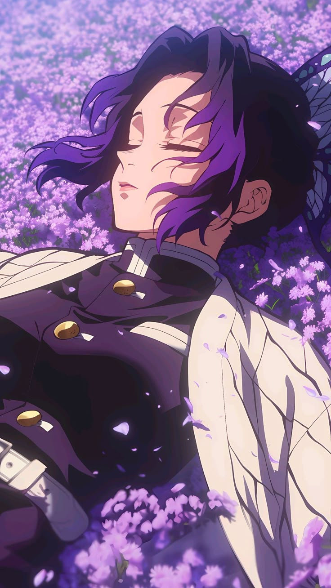

<!-- Profil GitHub — Tema Shinobu Kochou -->

  

<h1 align="center">🦋 こんにちは — I'm <strong>Satriasensei</strong>!</h1>

  

<blockquote align="center">
  “Even the smallest poison can bring down a giant. — Shinobu Kochou”
</blockquote>

---

### 🦋 Tentang Saya
- 💜 Penggemar **Shinobu Kochou** & estetika **butterfly**.
- 🧪 Fokus di **Laravel**, **Tailwind CSS**, **JavaScript**, **MySQL**.
- 🌱 Sedang belajar **Clean Architecture** dan **Testing**.
- 📫 Kontak: igedesatriaadinata@gmail.com | IG: @satriasensei

---

### ⚙️ Leaguan Program I Learn

---

### 📊 Stats

  
  

  

---

### 🖼️ Galeri

  
  
  

---

### 🧪 Project Pilihan
- 🦋 **Tampilan UI** — Membuat Project Sistem Uang Kas
- 🌸 **Desain Web** — Membuat Desain Website Sekolah
- 🧬 **UX** — Membuat Desain Web di Figma  

---

> *“Tetap tenang, tapi jangan lengah. Kupu-kupu terlihat rapuh, namun racunnya mematikan.”*

---

### 🎨 Palet Warna Shinobu
| Warna | Hex | Contoh |
|-------|-----|--------|
| Lavender | `#8B5CF6` |  |
| Lilac | `#A78BFA` |  |
| Teal | `#14B8A6` |  |
| Night | `#0D1117` |  |
| Soft White | `#F8FAFC` |  |

---

  

