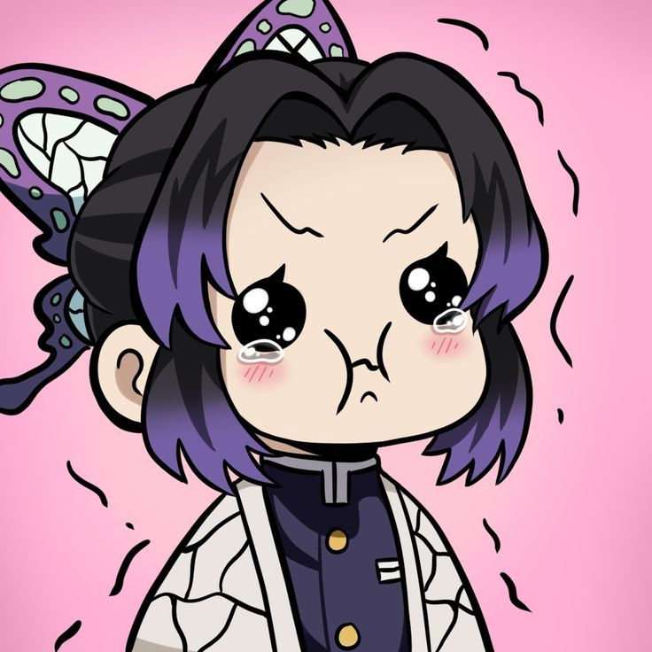

<!-- 🌸 Profil GitHub — Tema Shinobu Kochou -->

  

<h1 align="center">🦋 こんにちは — I'm <strong>Satriasensei</strong>!</h1>

  

<blockquote align="center">
  “Even the smallest poison can bring down a giant. — Shinobu Kochou”
</blockquote>

---

### 🦋 Tentang Saya
- 💜 Penggemar *Shinobu Kochou*
- 🧪 Fokus di *Laravel, Tailwind CSS, JavaScript, MySQL*
- 🌱 Sedang belajar *Clean Architecture* dan *Testing*
- 📫 Kontak: **igedesatriaadinata@gmail.com** | IG: [@satria_adinata15](https://instagram.com/satria_adinata15)

  
  

---

### ⚙ Languages & Tools

  

---

### 🏆 GitHub Trophy

  

---

### 📊 Stats

  
  

  

---

### 📈 Aktivitas Terbaru

  

---

### 🐍 Animasi Kontribusi

  

---

### 🧪 Project Pilihan
- 🦋 *UI/UX* — Sistem Uang Kas  
- 🌸 *Web Design* — Website Sekolah  
- 🧬 *Figma Prototype* — Web Company Profile  

---

### 🖼 Galeri Shinobu

  
  
  

---

### 🌸 Random Anime Quote

  

---

### 🎨 Palet Warna Shinobu
| Warna       | Hex     | Contoh |
|-------------|---------|--------|
| Lavender    | #8B5CF6 |  |
| Lilac       | #A78BFA |  |
| Teal        | #14B8A6 |  |
| Night       | #0D1117 |  |
| Soft White  | #F8FAFC |  |

---

### 📌 Pinned Projects

  
  

---

  

